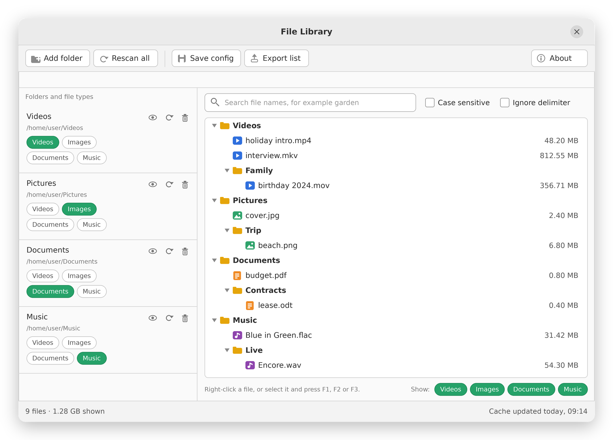

# File Library

File Library is a desktop app for Ubuntu that keeps an index of the videos, images, documents and music spread across your folders. Add one or more source folders, choose which file types to include for each of them, and browse everything in one tree with file sizes in MB.

The scan result is cached, so searching is instant and the app only rescans when you ask it to or when a folder's file types change. Search works case sensitive or case insensitive. Right-click any file to copy its full path or open the folder that contains it in your file manager, and export the current list as a plain text file.

Your folder setup is only kept when you press **Save config**, so you can try things out freely: unsaved changes are dropped when the app restarts.

Built with Python and GTK 4. Packaged as a `.deb` for Ubuntu 26.04.

<p align="center">
  
</p>
<p align="center"><em>Illustration of the main window: four folders, one per file type, and the combined file list.</em></p>

## Features

- Several source folders, each with its own file types: videos, images, documents, music
- Cached index; scans only when needed or when you press **Rescan all**
- Rescan everything with **Rescan all**, or a single folder with the refresh button on its entry
- Scan indicator with a **Stop scan** button
- Search on the file name only (the extension is ignored), with a case-sensitive option and an **Ignore delimiter** option: searching for `the time has come` also finds `the.time.has.come`, `the,time,has,come`, `the-time-has-come` and `the_time_has_come`
- Show or hide videos, images, documents and music in the list with the **Show** buttons at the bottom right of the list (shown types are green)
- Keyboard shortcuts, listed in **About**, tab **Shortcuts**: F1 open containing folder, F2 select file in manager, F3 copy file path, F5 rescan all, F6 export list, F7 save config
- The window size, maximized state and the position of the divider are restored on the next start
- Right-click a file: **Copy file path**, **Open containing folder** or **Select file in manager** (opens the file manager with the file selected)
- **Export list** saves the currently shown list as a `.txt` file
- Each folder entry has buttons to rescan it, hide its files from the list (eye button, its icon turns orange while a hidden folder is being scanned) and remove it
- The file list shows folder names only; hover a folder or file to see its full path
- **About** dialog with version, repository link and license
- **Save config** stores the folders, which of them are hidden, their file types, the **Case sensitive** and **Ignore delimiter** options and the **Show** filter; unsaved changes are shown in the title bar and lost on restart

## Install

Download `file-library_1.0.9_all.deb` from the [Releases](../../releases) page, then:

```bash
sudo apt install ./file-library_1.0.9_all.deb
```

This also installs the dependencies (`python3-gi`, `gir1.2-gtk-4.0`). After that, start **File Library** from the app grid or run `file-library` in a terminal.

## Usage

1. Click **Add folder** and pick a folder. New folders start with **Videos** selected.
2. Switch the **Videos / Images / Documents** toggles on the folder entry to choose what gets indexed. The folder is rescanned automatically.
3. Type in the search box to filter by file name. Tick **Case sensitive** if needed.
4. Right-click a file to copy its full path or open its folder.
5. Press **Save config** to keep your folders and file types for the next start.

### File types

| Type      | Extensions                                                        |
|-----------|-------------------------------------------------------------------|
| Videos    | mp4, m4v, mkv, avi, mov, wmv, flv, webm, mpg, mpeg, m2ts, mts, 3gp, ogv, vob |
| Images    | jpg, jpeg, png, gif, webp, bmp, tif, tiff, heic, heif, svg        |
| Documents | pdf, doc, docx, odt, rtf, txt, md, xls, xlsx, ods, csv, ppt, pptx, odp, epub |
| Music     | mp3, flac, ogg, oga, opus, wav, m4a, aac, wma, aiff, aif, ape     |

You can change the lists in `src/file_library_core.py`.

## Files the app writes

| File                                   | Purpose                                        |
|----------------------------------------|------------------------------------------------|
| `~/.config/file-library/config.json`   | Folders, file types, search options and the type filter, written by **Save config** |
| `~/.config/file-library/window.json`   | Window size and divider position, written when the window closes |
| `~/.cache/file-library/cache.json`     | Scanned file index                             |

## Run from source

```bash
sudo apt install python3 python3-gi gir1.2-gtk-4.0
python3 src/file_library.py
```

## Build the .deb

```bash
./build-deb.sh
sudo apt install ./build/file-library_1.0.9_all.deb
```

Building only needs `dpkg-deb`, which Ubuntu already includes. The version is defined in `packaging/control` and `src/file_library_core.py`; the build stops if the two differ. `tools/render_icons.py` regenerates the PNG icons and needs Pillow (`python3-pil`).

## Project layout

```
src/file_library.py        GTK 4 interface
src/file_library_core.py   scanning, config, cache, export, version (no GUI code)
bin/file-library           launcher script installed to /usr/bin
data/                      .desktop entry and icons (SVG and PNG sizes)
packaging/                 Debian control file, copyright and install hooks
tools/render_icons.py      renders the PNG icons
tools/render_screenshot.py renders docs/screenshot.png (an illustration, not a capture)
docs/screenshot.png        image shown at the top of this README
build-deb.sh               assembles the .deb
```

## License

Released under the [MIT License](LICENSE).
